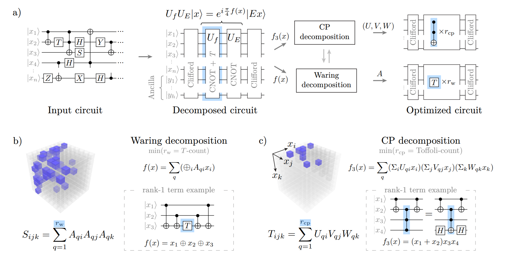

# Polytof (phase POLYnomial TOFfoli minimization)

<p align="center">
  
</p>

Polytof minimizes non-Clifford gate counts in quantum circuits over {H, CNOT, Toffoli}, with primary focus on **Toffoli count** (equivalently, CCZ count) and additionally **T-count**. The approach: concentrate all non-Clifford gates into a single phase operator defined by a phase polynomial, represent this polynomial as a symmetric cubic tensor over 𝔽₂, then decompose the tensor. The CP rank of the tensor equals the Toffoli count; the Waring rank equals the T-count.

Concretely, the task is to decompose a cubic polynomial (defined up to quadratic
and linear terms) into a sum of products of three linear forms, e.g.

```math
x_0 x_1 x_2 + x_0 x_1 x_4 + x_0 x_1 x_5 + x_0 x_1 x_7 + x_0 x_2 x_4 + x_2 x_3 x_4 + x_2 x_4 x_6 = (x_0)(x_1)(x_2 + x_4 + x_5 + x_7) + (x_2)(x_4)(x_0 + x_3 + x_6)
```

Each term on the right corresponds to one Toffoli (CCZ) gate.

> **Note:** Formally, we compute the CP rank over some equivalence class, thus solving the skew-symmetric rank problem.

The optimization pipeline has three stages:

1. **BCO** (Basis Change Optimization) — prepend a CNOT circuit (basis change) before the phase operator to minimize the algebraic thickness of the phase polynomial, equivalently the nnz of the tensor
2. **CPD** (Canonical Polyadic Decomposition) — find a low-rank CP decomposition using **SGE** (Symplectic Gaussian Elimination) and **FGS** (Flip Graph Search)
3. **Waring decomposition** — convert CP decomposition to Waring form and optimize T-count via **FastTODD**

## Quick Start

**Prerequisites:** C++20 compiler (GCC 12+ or Clang 15+), Python 3.8+ with NumPy.

```bash
# Build
g++ -Ofast -std=c++20 -march=native -s -pthread -I third_party -I src src/bco.cpp -o bin/bco
g++ -D VEC_WORDS=1 -Ofast -std=c++20 -march=native -s -pthread -I third_party -I src src/cpd.cpp -o bin/topp1
g++ -D VEC_WORDS=1 -Ofast -std=c++20 -march=native -s -pthread -I third_party -I src src/waring.cpp -o bin/waring1

# Run on tensor 0101 (Barenco Tof_3)
bin/bco 101 -b 10 -t 8 --save --verify -v          # BCO: reduce nnz
bin/topp1 1101 --sge --fgs -s 200 -t 8 --save      # CPD: find Toffoli count
bin/waring1 1101 --cpd -n 10 -b 3 -t 8 --save      # Waring: find T-count
```

For a full walkthrough (from `.qc` circuit to optimized Toffoli and T-count), see **[examples/README.ipynb](examples/README.ipynb)**.

## Project Structure

```
src/
  compile.cpp       circuit compiler .qc → phase polynomial → tensor
  bco.cpp           BCO
  cpd.cpp           SGE + FGS
  waring.cpp        FastTODD
                        
scripts/                 
examples/           notebook tutorial
data/ 
docs/
third_party/
```

## Documentation

- **[docs/cli.md](docs/cli.md)** — CLI reference for all tools, build options
- **[docs/tensors.md](docs/tensors.md)** — tensor index with found ranks
- **[docs/scripts.md](docs/scripts.md)** — Python scripts reference
- **[examples/README.ipynb](examples/README.ipynb)** — step-by-step guide
